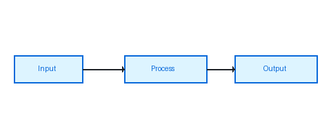

# Markdown Feature Showcase

A comprehensive example demonstrating everything `md-pdf` can render —
typography, code, tables, images, non-ASCII text, emoji, and more.

---

## Table of Contents

[TOC]

---

## 1. Typography & Inline Formatting

Regular paragraph text with **bold**, _italic_, ~~strikethrough~~, and
`inline code`. You can also combine them: **_bold italic_** and
**~~bold strikethrough~~**.

Superscript-like notation: H~2~O and E = mc^2^ (rendered as plain text here).

A [hyperlink to GitHub](https://github.com) and a
[link with a title](https://example.com "Visit Example").

Auto-detected URL: <https://www.python.org>

Email link: <hello@example.com>

---

## 2. Emoji & Unicode 🎉

Emoji are fully supported inline: 🚀 🐍 🦀 💎 🌍 🔥 ✅ ❌ ⚠️ 💡 🎨 📄

### Non-ASCII Scripts

**Greek:** Ω φ π ε δ — Ἐν ἀρχῇ ἦν ὁ λόγος

**Cyrillic:** Привет мир! Быстрая коричневая лиса.

**Arabic (RTL):** مرحبًا بالعالم — النص العربي يُكتب من اليمين إلى اليسار.

**Chinese (Simplified):** 你好，世界！快速的棕色狐狸跳过了懒狗。

**Japanese:** こんにちは世界！日本語のテキスト。

**Korean:** 안녕하세요 세계! 빠른 갈색 여우가 게으른 개를 뛰어넘었습니다.

**Hebrew:** שלום עולם! הטקסט העברי.

**Mathematical symbols:** ∑ ∫ ∂ ∇ ∞ ≈ ≠ ≤ ≥ ∈ ∉ ∀ ∃ ⊂ ⊃ ∩ ∪ ℝ ℂ ℕ ℤ

**Currency:** $ € £ ¥ ₹ ₩ ₿ ₽

---

## 3. Images

### Color Palette


### Bar Chart

This chart was generated with Pillow to demonstrate image embedding:


### Pipeline Diagram



---

## 4. Blockquotes

> "Programs must be written for people to read, and only incidentally for
> machines to execute."
>
> — Harold Abelson, *Structure and Interpretation of Computer Programs*

Nested blockquote:

> Outer quote — this is the first level.
>
> > Inner quote — this is a nested level, useful for reply threads.
> >
> > It can span multiple paragraphs.
>
> Back to the outer level.

Blockquote with code inside:

> Use `git rebase -i HEAD~3` to interactively rebase the last three commits.
> This rewrites history, so **never do this on a shared branch.**

---

## 5. Lists

### Unordered

- Fruits
  - 🍎 Apple
  - 🍌 Banana
  - 🍊 Orange
    - Navel orange
    - Blood orange
- Vegetables
  - 🥦 Broccoli
  - 🥕 Carrot

### Ordered

1. Clone the repository
2. Install dependencies
   1. Install Python ≥ 3.13
   2. Run `uv sync`
3. Run the application
4. Profit 💰

### Task List

- [x] Design CLI interface
- [x] Add Markdown parser
- [x] Implement syntax highlighting
- [x] Add GitHub-like CSS
- [ ] Write comprehensive tests
- [ ] Publish to PyPI

### Definition List

Markdown
:   A lightweight markup language for creating formatted text using a plain-text editor.

PDF
:   Portable Document Format — a file format developed by Adobe to present documents
    independent of application software, hardware, and operating systems.

WeasyPrint
:   A smart solution helping web developers to create PDF documents. It turns simple
    HTML pages into gorgeous statistical reports, invoices, books and more.

---

## 6. Tables

### Simple Table

| Language   | Paradigm          | Typing   | First appeared |
|------------|-------------------|----------|----------------|
| Python     | Multi-paradigm    | Dynamic  | 1991           |
| Rust       | Systems           | Static   | 2010           |
| JavaScript | Multi-paradigm    | Dynamic  | 1995           |
| Go         | Concurrent        | Static   | 2009           |
| Haskell    | Functional        | Static   | 1990           |
| SQL        | Declarative       | Static   | 1974           |

### Aligned Columns

| Metric             | Value     | Unit    | Change   |
|:-------------------|----------:|:-------:|:---------|
| Throughput         | 142,857   | req/s   | +12.3%   |
| Latency (p50)      | 3.2       | ms      | -0.8ms   |
| Latency (p99)      | 18.7      | ms      | -2.1ms   |
| Error rate         | 0.003     | %       | +0.001%  |
| Memory usage       | 512       | MB      | -64 MB   |
| CPU utilization    | 34        | %       | -6%      |

---

## 7. Code Samples

### Python — Async HTTP Client

```python
import asyncio
import httpx
from dataclasses import dataclass
from typing import Any

@dataclass
class ApiResponse:
    status: int
    data: dict[str, Any]
    headers: dict[str, str]

async def fetch_all(urls: list[str], timeout: float = 10.0) -> list[ApiResponse]:
    """Fetch multiple URLs concurrently and return parsed responses."""
    async with httpx.AsyncClient(timeout=timeout) as client:
        tasks = [client.get(url) for url in urls]
        responses = await asyncio.gather(*tasks, return_exceptions=True)

    results = []
    for resp in responses:
        if isinstance(resp, Exception):
            print(f"Request failed: {resp}")
            continue
        results.append(ApiResponse(
            status=resp.status_code,
            data=resp.json(),
            headers=dict(resp.headers),
        ))
    return results

async def main() -> None:
    urls = [
        "https://api.github.com/repos/python/cpython",
        "https://api.github.com/repos/rust-lang/rust",
    ]
    responses = await fetch_all(urls)
    for r in responses:
        print(f"[{r.status}] stars: {r.data.get('stargazers_count', 'n/a')}")

if __name__ == "__main__":
    asyncio.run(main())
```

### TypeScript — Generic Repository Pattern

```typescript
interface Entity {
  id: string;
  createdAt: Date;
  updatedAt: Date;
}

interface Repository<T extends Entity> {
  findById(id: string): Promise<T | null>;
  findAll(filter?: Partial<T>): Promise<T[]>;
  create(data: Omit<T, keyof Entity>): Promise<T>;
  update(id: string, data: Partial<Omit<T, keyof Entity>>): Promise<T>;
  delete(id: string): Promise<void>;
}

class InMemoryRepository<T extends Entity> implements Repository<T> {
  private store = new Map<string, T>();

  async findById(id: string): Promise<T | null> {
    return this.store.get(id) ?? null;
  }

  async findAll(filter?: Partial<T>): Promise<T[]> {
    const all = Array.from(this.store.values());
    if (!filter) return all;
    return all.filter(item =>
      Object.entries(filter).every(([k, v]) => item[k as keyof T] === v)
    );
  }

  async create(data: Omit<T, keyof Entity>): Promise<T> {
    const entity = {
      ...data,
      id: crypto.randomUUID(),
      createdAt: new Date(),
      updatedAt: new Date(),
    } as unknown as T;
    this.store.set(entity.id, entity);
    return entity;
  }

  async update(id: string, data: Partial<Omit<T, keyof Entity>>): Promise<T> {
    const existing = await this.findById(id);
    if (!existing) throw new Error(`Entity ${id} not found`);
    const updated = { ...existing, ...data, updatedAt: new Date() };
    this.store.set(id, updated);
    return updated;
  }

  async delete(id: string): Promise<void> {
    this.store.delete(id);
  }
}
```

### Rust — Concurrent Task Runner

```rust
use std::sync::Arc;
use tokio::sync::{Mutex, Semaphore};
use tokio::task::JoinSet;

#[derive(Debug)]
pub struct TaskRunner {
    concurrency: usize,
    results: Arc<Mutex<Vec<String>>>,
}

impl TaskRunner {
    pub fn new(concurrency: usize) -> Self {
        Self {
            concurrency,
            results: Arc::new(Mutex::new(Vec::new())),
        }
    }

    pub async fn run<F, Fut>(&self, tasks: Vec<F>) -> Vec<String>
    where
        F: Fn() -> Fut + Send + 'static,
        Fut: std::future::Future<Output = String> + Send,
    {
        let semaphore = Arc::new(Semaphore::new(self.concurrency));
        let results = Arc::clone(&self.results);
        let mut join_set = JoinSet::new();

        for task in tasks {
            let permit = Arc::clone(&semaphore);
            let results = Arc::clone(&results);

            join_set.spawn(async move {
                let _permit = permit.acquire().await.unwrap();
                let output = task().await;
                results.lock().await.push(output);
            });
        }

        while let Some(res) = join_set.join_next().await {
            if let Err(e) = res {
                eprintln!("Task panicked: {:?}", e);
            }
        }

        let mut guard = self.results.lock().await;
        std::mem::take(&mut *guard)
    }
}

#[tokio::main]
async fn main() {
    let runner = TaskRunner::new(4);
    let tasks: Vec<_> = (0..10)
        .map(|i| move || async move { format!("task-{i} done") })
        .collect();

    let outputs = runner.run(tasks).await;
    for o in outputs {
        println!("{o}");
    }
}
```

### Go — HTTP Middleware Chain

```go
package main

import (
	"context"
	"log/slog"
	"net/http"
	"time"
)

type Middleware func(http.Handler) http.Handler

func Chain(h http.Handler, middlewares ...Middleware) http.Handler {
	for i := len(middlewares) - 1; i >= 0; i-- {
		h = middlewares[i](h)
	}
	return h
}

func Logger(logger *slog.Logger) Middleware {
	return func(next http.Handler) http.Handler {
		return http.HandlerFunc(func(w http.ResponseWriter, r *http.Request) {
			start := time.Now()
			rec := &statusRecorder{ResponseWriter: w, status: http.StatusOK}
			next.ServeHTTP(rec, r)
			logger.Info("request",
				"method", r.Method,
				"path", r.URL.Path,
				"status", rec.status,
				"duration", time.Since(start),
			)
		})
	}
}

func Timeout(d time.Duration) Middleware {
	return func(next http.Handler) http.Handler {
		return http.HandlerFunc(func(w http.ResponseWriter, r *http.Request) {
			ctx, cancel := context.WithTimeout(r.Context(), d)
			defer cancel()
			next.ServeHTTP(w, r.WithContext(ctx))
		})
	}
}

type statusRecorder struct {
	http.ResponseWriter
	status int
}

func (r *statusRecorder) WriteHeader(code int) {
	r.status = code
	r.ResponseWriter.WriteHeader(code)
}

func main() {
	logger := slog.Default()
	mux := http.NewServeMux()
	mux.HandleFunc("/", func(w http.ResponseWriter, _ *http.Request) {
		w.Write([]byte("Hello, world!\n"))
	})

	handler := Chain(mux,
		Logger(logger),
		Timeout(5*time.Second),
	)
	http.ListenAndServe(":8080", handler)
}
```

### SQL — Window Functions & CTEs

```sql
-- Monthly revenue with running total and rank
WITH monthly_revenue AS (
    SELECT
        DATE_TRUNC('month', o.created_at)  AS month,
        p.category,
        SUM(oi.quantity * oi.unit_price)   AS revenue,
        COUNT(DISTINCT o.customer_id)      AS unique_customers
    FROM orders o
    JOIN order_items oi ON oi.order_id = o.id
    JOIN products p     ON p.id = oi.product_id
    WHERE o.status = 'completed'
      AND o.created_at >= NOW() - INTERVAL '12 months'
    GROUP BY 1, 2
),
ranked AS (
    SELECT
        month,
        category,
        revenue,
        unique_customers,
        RANK() OVER (PARTITION BY month ORDER BY revenue DESC) AS revenue_rank,
        SUM(revenue) OVER (
            PARTITION BY category
            ORDER BY month
            ROWS BETWEEN UNBOUNDED PRECEDING AND CURRENT ROW
        ) AS cumulative_revenue,
        LAG(revenue, 1) OVER (PARTITION BY category ORDER BY month) AS prev_month_revenue
    FROM monthly_revenue
)
SELECT
    month,
    category,
    revenue,
    unique_customers,
    revenue_rank,
    cumulative_revenue,
    ROUND(
        100.0 * (revenue - prev_month_revenue) / NULLIF(prev_month_revenue, 0),
        2
    ) AS mom_growth_pct
FROM ranked
WHERE revenue_rank <= 5
ORDER BY month DESC, revenue_rank;
```

### Bash — Deployment Script

```bash
#!/usr/bin/env bash
set -euo pipefail

APP_NAME="my-service"
DEPLOY_DIR="/opt/${APP_NAME}"
BACKUP_DIR="/opt/backups/${APP_NAME}"
TIMESTAMP=$(date +%Y%m%d_%H%M%S)

log() { echo "[$(date -u +%FT%TZ)] $*" >&2; }
die() { log "ERROR: $*"; exit 1; }

require_cmd() {
    command -v "$1" &>/dev/null || die "Required command not found: $1"
}

require_cmd docker
require_cmd curl

log "Starting deployment of ${APP_NAME} — ${TIMESTAMP}"

# Health check before deployment
HEALTH=$(curl -sf "http://localhost:8080/health" | jq -r '.status' 2>/dev/null || echo "unreachable")
log "Pre-deploy health: ${HEALTH}"

# Backup current version
if [[ -d "${DEPLOY_DIR}" ]]; then
    log "Backing up current deployment..."
    mkdir -p "${BACKUP_DIR}"
    tar -czf "${BACKUP_DIR}/${TIMESTAMP}.tar.gz" -C "${DEPLOY_DIR}" .
fi

# Pull and restart
log "Pulling latest image..."
docker pull "${APP_NAME}:latest"

log "Restarting service..."
docker compose -f "${DEPLOY_DIR}/docker-compose.yml" up -d --remove-orphans

# Wait for healthy
for i in {1..30}; do
    STATUS=$(curl -sf "http://localhost:8080/health" | jq -r '.status' 2>/dev/null || echo "")
    if [[ "${STATUS}" == "ok" ]]; then
        log "Service healthy after ${i}s."
        exit 0
    fi
    sleep 1
done

die "Service failed to become healthy within 30 seconds. Check logs."
```

### C — Generic Dynamic Array

```c
#include <stdio.h>
#include <stdlib.h>
#include <string.h>

typedef struct {
    void   *data;
    size_t  len;
    size_t  cap;
    size_t  elem_size;
} Vec;

Vec vec_new(size_t elem_size) {
    return (Vec){ .data = NULL, .len = 0, .cap = 0, .elem_size = elem_size };
}

int vec_push(Vec *v, const void *elem) {
    if (v->len == v->cap) {
        size_t new_cap = v->cap == 0 ? 8 : v->cap * 2;
        void  *new_data = realloc(v->data, new_cap * v->elem_size);
        if (!new_data) return -1;
        v->data = new_data;
        v->cap  = new_cap;
    }
    memcpy((char *)v->data + v->len * v->elem_size, elem, v->elem_size);
    v->len++;
    return 0;
}

void *vec_get(const Vec *v, size_t i) {
    if (i >= v->len) return NULL;
    return (char *)v->data + i * v->elem_size;
}

void vec_free(Vec *v) {
    free(v->data);
    v->data = NULL;
    v->len  = 0;
    v->cap  = 0;
}

int main(void) {
    Vec v = vec_new(sizeof(int));
    for (int i = 0; i < 10; i++) vec_push(&v, &i);

    for (size_t i = 0; i < v.len; i++) {
        printf("%d ", *(int *)vec_get(&v, i));
    }
    printf("\n");

    vec_free(&v);
    return 0;
}
```

### JSON — Configuration Schema

```json
{
  "$schema": "https://json-schema.org/draft/2020-12/schema",
  "title": "AppConfig",
  "description": "Application configuration schema",
  "type": "object",
  "required": ["server", "database"],
  "properties": {
    "server": {
      "type": "object",
      "properties": {
        "host":    { "type": "string", "default": "0.0.0.0" },
        "port":    { "type": "integer", "minimum": 1, "maximum": 65535, "default": 8080 },
        "workers": { "type": "integer", "minimum": 1, "default": 4 },
        "tls": {
          "type": "object",
          "properties": {
            "enabled":  { "type": "boolean" },
            "cert_file": { "type": "string" },
            "key_file":  { "type": "string" }
          }
        }
      }
    },
    "database": {
      "type": "object",
      "required": ["url"],
      "properties": {
        "url":          { "type": "string", "format": "uri" },
        "pool_size":    { "type": "integer", "default": 10 },
        "pool_timeout": { "type": "number", "default": 30.0 },
        "echo_sql":     { "type": "boolean", "default": false }
      }
    },
    "logging": {
      "type": "object",
      "properties": {
        "level":  { "type": "string", "enum": ["DEBUG", "INFO", "WARNING", "ERROR"] },
        "format": { "type": "string", "enum": ["json", "text"] }
      }
    }
  }
}
```

### YAML — Kubernetes Deployment

```yaml
apiVersion: apps/v1
kind: Deployment
metadata:
  name: web-api
  namespace: production
  labels:
    app: web-api
    version: "2.4.1"
spec:
  replicas: 3
  selector:
    matchLabels:
      app: web-api
  strategy:
    type: RollingUpdate
    rollingUpdate:
      maxSurge: 1
      maxUnavailable: 0
  template:
    metadata:
      labels:
        app: web-api
    spec:
      containers:
        - name: api
          image: my-org/web-api:2.4.1
          ports:
            - containerPort: 8080
          env:
            - name: DATABASE_URL
              valueFrom:
                secretKeyRef:
                  name: db-secret
                  key: url
            - name: LOG_LEVEL
              value: "INFO"
          resources:
            requests:
              cpu: "100m"
              memory: "128Mi"
            limits:
              cpu: "500m"
              memory: "512Mi"
          livenessProbe:
            httpGet:
              path: /health
              port: 8080
            initialDelaySeconds: 10
            periodSeconds: 15
          readinessProbe:
            httpGet:
              path: /ready
              port: 8080
            initialDelaySeconds: 5
            periodSeconds: 5
```

### HTML + CSS — Card Component

```html
<!DOCTYPE html>
<html lang="en">
<head>
  <meta charset="UTF-8">
  <style>
    .card {
      display: flex;
      flex-direction: column;
      gap: 12px;
      padding: 20px;
      border-radius: 12px;
      border: 1px solid #d1d9e0;
      background: #fff;
      max-width: 360px;
      font-family: system-ui, sans-serif;
    }

    .card__avatar {
      width: 48px;
      height: 48px;
      border-radius: 50%;
      background: linear-gradient(135deg, #0969da, #8250df);
    }

    .card__title {
      font-size: 1.1rem;
      font-weight: 600;
      color: #1f2328;
      margin: 0;
    }

    .card__badge {
      display: inline-block;
      padding: 2px 8px;
      border-radius: 999px;
      font-size: 0.75rem;
      background: #ddf4ff;
      color: #0969da;
    }
  </style>
</head>
<body>
  <div class="card">
    <div class="card__avatar"></div>
    <h2 class="card__title">Jane Smith</h2>
    <span class="card__badge">Staff Engineer</span>
    <p>Building reliable distributed systems. Open source contributor. 🦀</p>
  </div>
</body>
</html>
```

---

## 8. Footnotes

Markdown was created by John Gruber[^1] in 2004 and has since become the
de facto standard for writing on the web.[^2]

WeasyPrint converts HTML and CSS to PDF using the Pango[^3] layout engine.

[^1]: John Gruber — <https://daringfireball.net>
[^2]: See also the CommonMark specification at <https://commonmark.org>
[^3]: Pango is a library for laying out and rendering text — <https://pango.gnome.org>

---

## 9. Horizontal Rules

Three ways to draw a rule:

---

***

___

---

## 10. Smartypants Punctuation

The "smarty" extension converts straight quotes and dashes:

- "double quotes" become curly "double quotes"
- 'single quotes' become curly 'single quotes'
- -- becomes an en dash —
- --- becomes an em dash —
- ... becomes an ellipsis…

---

## 11. Long Paragraph / Prose

The history of markup languages stretches back decades. Before the web,
documents were typeset using systems like TeX — Donald Knuth's masterwork,
published in 1978 — or troff, the document formatting system developed at
Bell Labs. These systems gave authors precise control over layout but
required deep expertise to use effectively.

HTML changed everything. By separating *structure* from *presentation*,
it allowed non-experts to create documents that could be viewed on any
device. But HTML's verbosity made it poorly suited for writing prose.
Enter Markdown: a lightweight syntax that compiles to HTML, letting
authors focus on content rather than tags.

Today, Markdown powers GitHub READMEs, technical documentation,
static site generators, note-taking apps, and — thanks to tools like
this one — printable PDFs. The simplicity that made it successful also
means there is no single canonical Markdown; dozens of flavors exist,
each adding features the original spec omitted: tables, task lists,
footnotes, fenced code blocks, strikethrough, and more.

> "The overriding design goal for Markdown's formatting syntax is to
> make it as readable as possible."
>
> — John Gruber

---

*Generated by `md-pdf` — <https://github.com>* 🎉
